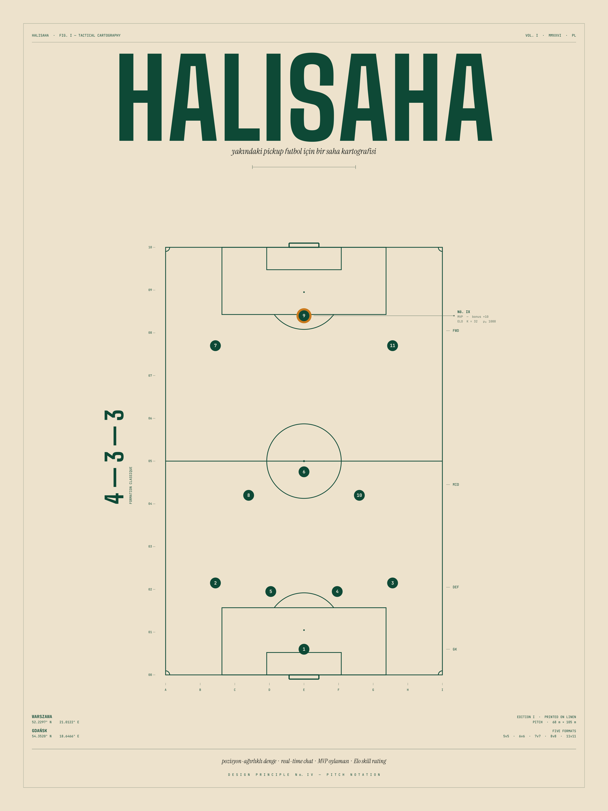

<div align="center">


### Pickup football, organized.

Find a match nearby. Auto-balanced teams. Real-time chat. MVP voting. Elo rating.
Built for the neighborhood pitches of **Gdańsk** and **Warszawa**.

<br />

[](https://nextjs.org)
[](https://www.typescriptlang.org)
[](https://supabase.com)
[](https://tailwindcss.com)
[](tests/unit)
[](CHANGELOG.md)

<br />



</div>

<br />

## What it does

- **Find a match** — map of nearby open pickup events in your city
- **Join a roster** — organizer-approval flow, position pick (GK / DEF / MID / FWD)
- **Auto-balance** — position-weighted snake-draft + hill-climb, with drag-drop manual override
- **Chat live** — event-scoped real-time room, system messages on every state change
- **Submit & rate** — score entry, K=32 Elo, 7-day MVP voting, +10 bonus
- **Track progress** — pure-SVG rating chart, recent matches, public profile at `/u/[username]`
- **Stay private** — anonymous auth, no email, no IP tracking, GDPR/RODO aligned
- **Speak your language** — TR · EN · PL

## Quick start

```bash
pnpm install
cp .env.example .env.local        # fill in Supabase keys
for f in supabase/migrations/*.sql; do
  node --env-file=.env.local scripts/apply-migration.mjs "$f"
done
node --env-file=.env.local scripts/seed-venues.mjs
pnpm dev                          # → http://localhost:3000
```

Full setup notes (Supabase project creation, env vars, anonymous auth toggle): see [docs/setup.md][setup] _(coming soon — for now, the comments inside `.env.example` and the runbook below)._

## The stack

**Frontend** Next.js 15 · TypeScript strict · Tailwind v4 · shadcn/ui · MapLibre GL · @dnd-kit
**Backend** Supabase (Postgres + PostGIS + Auth + Realtime) · Drizzle ORM · SECURITY DEFINER RPCs
**Quality** Vitest (40 unit tests) · ESLint · Prettier · Husky pre-commit
**i18n** next-intl with TR (default) · EN · PL
**Tooling** pnpm · Turbopack · date-fns-tz (Europe/Warsaw)

## Documentation

| Read                                                                   | When                                                                              |
| ---------------------------------------------------------------------- | --------------------------------------------------------------------------------- |
| [HALISAHA_SPEC.md](HALISAHA_SPEC.md)                                   | The single source of truth — 23 sections, 929 lines                               |
| [CHANGELOG.md](CHANGELOG.md)                                           | Phase-by-phase narrative (Phases 0–9)                                             |
| [docs/decisions/](docs/decisions/)                                     | Four ADRs (Next 15 lock-in, anonymous auth, organizer approval, RLS for Realtime) |
| [design/halisaha-pitch-notation.md](design/halisaha-pitch-notation.md) | Brand visual philosophy                                                           |

<details>
<summary><strong>Architecture overview</strong></summary>

```
┌─────────────────────────┐
│  Browser (Next.js 15)   │  Server Components + client islands
│  - MapLibre GL          │  Tailwind v4 · shadcn/ui · next-intl
│  - @dnd-kit drag-drop   │  TanStack Query + Sonner
└────────────┬────────────┘
             │  Server Actions + Supabase JS (RPC + Realtime)
             ▼
┌─────────────────────────────────────────────────────────────────────┐
│                       Supabase Cloud (eu-central-1)                  │
│  PostgreSQL + PostGIS  ·  Anonymous Auth  ·  Realtime postgres_changes
│                                                                      │
│  Read paths:    public RLS                                           │
│  Write paths:   SECURITY DEFINER RPCs with advisory locks            │
│                 join_event · approve/reject_participant · save_teams │
│                 submit_score · edit_score · finalize_mvp · …         │
│                                                                      │
│  Triggers:      organizer auto-join · notification fan-out           │
└─────────────────────────────────────────────────────────────────────┘
```

</details>

<details>
<summary><strong>Migration runbook</strong></summary>

Migrations are numbered SQL files (`supabase/migrations/000N_*.sql`). They are not idempotent — apply each exactly once.

```bash
# Single file
node --env-file=.env.local scripts/apply-migration.mjs supabase/migrations/0016_notifications.sql

# All in order
for f in supabase/migrations/*.sql; do
  node --env-file=.env.local scripts/apply-migration.mjs "$f"
done

# Drizzle: schema → migration
pnpm db:generate

# Drizzle: push to dev DB
pnpm db:push
```

> RLS, SECURITY DEFINER RPCs, and triggers live in the hand-written SQL files — not the Drizzle schema. Drizzle covers tables, enums, and indexes only.

</details>

<details>
<summary><strong>Deployment (Vercel)</strong></summary>

```bash
pnpm i -g vercel
vercel link
vercel --prod
```

Production env: `NEXT_PUBLIC_SUPABASE_URL`, `NEXT_PUBLIC_SUPABASE_PUBLISHABLE_KEY`, `SUPABASE_SECRET_KEY`, `DATABASE_URL`, `NEXT_PUBLIC_SITE_URL`.

Pre-flight checklist:

- [ ] Anonymous sign-ins enabled in Supabase Auth
- [ ] Realtime publication includes every relevant table — verify with `node --env-file=.env.local scripts/check-publication.mjs`
- [ ] All migrations applied (0001..0016)
- [ ] Venues seeded
- [ ] Privacy + Terms placeholders replaced; `contact@halisaha.example` swapped for a real address

</details>

<details>
<summary><strong>Scripts</strong></summary>

| Command            | Purpose                     |
| ------------------ | --------------------------- |
| `pnpm dev`         | Turbopack dev server        |
| `pnpm build`       | Production build            |
| `pnpm typecheck`   | `tsc --noEmit`              |
| `pnpm lint`        | ESLint                      |
| `pnpm format`      | Prettier write              |
| `pnpm test`        | Vitest run (40 tests)       |
| `pnpm test:watch`  | Vitest watch                |
| `pnpm db:generate` | Drizzle: schema → migration |
| `pnpm db:push`     | Drizzle: apply to dev DB    |
| `pnpm db:studio`   | Drizzle Studio              |

</details>

<details>
<summary><strong>Folder layout</strong></summary>

```
src/
  app/[locale]/             Localised routes (tr/en/pl)
    layout.tsx              Inter font, providers, skip-link, footer, cookie banner
    page.tsx                Landing + JoinModal
    events/(page,new,[id])/ Event feed, create form, detail with all panels
    venues/(page,[id])/     Venue list and detail
    profile/(page,edit)/    Self profile + edit
    u/[username]/           Public profile
    legal/(privacy,terms)/  GDPR/RODO placeholders
  components/
    ui/                     shadcn primitives (Button, Input, Dialog, EmptyState…)
    auth, event, map, profile, notification, …
  lib/
    supabase/{server,client,middleware}.ts
    event/{state,rsvp,team,result,chat}-actions.ts
    balance/algorithm.ts    Snake-draft + hill-climb
    elo.ts                  K=32 + skill_level derivation
    profile/stats-queries.ts
    notification/actions.ts
  db/schema.ts              All tables in one file
  i18n/{routing,request,navigation}.ts
  middleware.ts             Supabase session + locale routing
supabase/migrations/        16 numbered SQL files
scripts/                    apply-migration · seed-venues · check-publication
tests/unit/                 balance.test.ts (15) · elo.test.ts (25)
messages/                   tr.json (default) · en.json · pl.json
docs/decisions/             ADR-0001..0004
design/                     Brand poster artifact (PDF + PNG + philosophy)
```

</details>

<details>
<summary><strong>Engineering principles</strong></summary>

- TypeScript strict, no `any` — `unknown` + zod parse for unknown data
- Server Components by default; `"use client"` only when interaction or a browser API requires it
- Mutations via Server Actions; no REST or GraphQL
- Single Drizzle schema file at `src/db/schema.ts`
- Path alias `@/*` → `./src/*`; never `../../..`
- Every public route is locale-prefixed (`/tr`, `/en`, `/pl`); default TR
- Postgres stores `timestamptz`; UI converts on render via date-fns-tz (Europe/Warsaw)
- Server Action contract: `{ ok: true, data } | { ok: false, error, code }`
- Read paths via public RLS; write paths only through atomic SECURITY DEFINER RPCs
- Realtime tables: `REPLICA IDENTITY FULL` + `supabase_realtime` publication; RLS must be `TO anon, authenticated USING (...)` (see [ADR-0004](docs/decisions/0004-chat-rls-relaxed-for-realtime.md))
- No PII in public profile selects (lat/lng excluded); no email in schema (anonymous auth)
- ESLint enforces `no-console`

</details>

## Status

**MVP complete.** All ten phases shipped — see [CHANGELOG.md](CHANGELOG.md). Next steps live in the post-MVP backlog: Playwright smoke, Lighthouse CI, profanity filter, MVP auto-finalize cron, "save my account" upgrade path, avatar upload, Sentry + Upstash.

## License

Not yet decided — placeholder until post-MVP (spec §15.2).

[setup]: docs/setup.md
