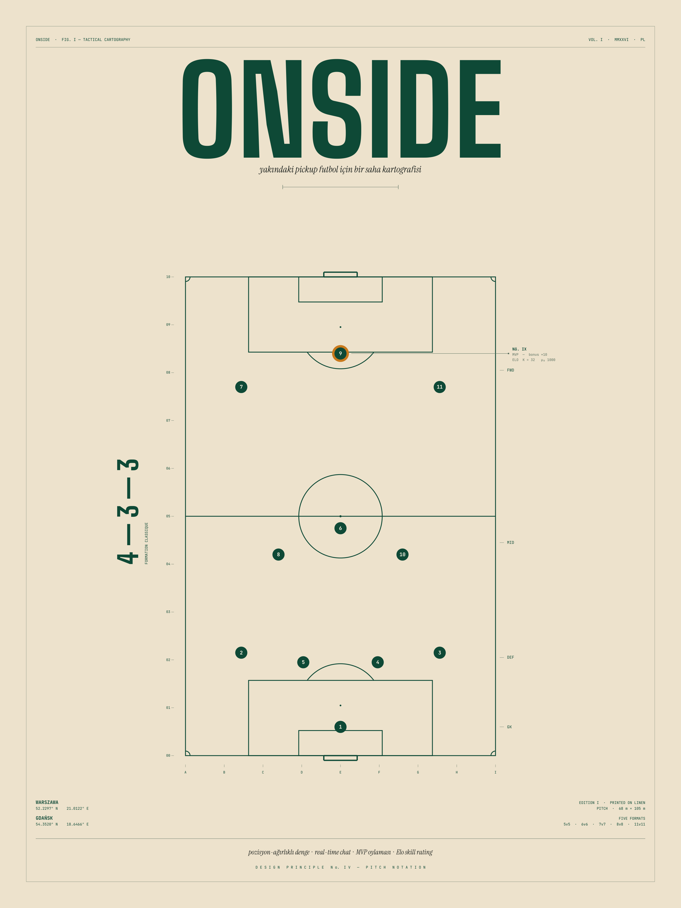

# Pickup football, organized.

**Find a match in Gdańsk. Pick a nickname. Play.**

No signups. No emails. No passwords. Just turn up.

 

### → [onside-boisko.vercel.app](https://onside-boisko.vercel.app)

 

 

---

## The idea

Pickup football already works. Friends-of-friends agree on a time, somebody
brings the ball, two teams form on the spot. The hard part is the
**coordination** — group chats fragment, the headcount shifts every hour,
nobody knows the final score.

Onside is the smallest tool that fixes that, and nothing else.

 

## What you can do

🟢 **See what's on, near you.** Open the map, see open matches, tap to read
times, formats, and who's in.

🟢 **Reserve your spot in three taps.** Type a nickname, choose a position,
hit join. That's the whole flow.

🟢 **Talk to the roster in real time.** Every match has its own chat — system
messages keep everyone in the loop when teams change or a match is
cancelled.

🟢 **Form fair teams instantly.** Once enough players are confirmed, an
algorithm balances them by position. Drag-and-drop fine-tunes if you want.

🟢 **Wrap the night with a final score.** Anyone in the match can submit
the result. The scoreline shows up in the chat for everyone.

 

## Why no accounts

Pickup matches are decided in the same evening. We don't need to know who
you are next month. A nickname kept on your device is enough — it follows
you across the chat, the roster, and the score form on this phone, and
nothing else. Switch the name any time. Wipe your browser and start fresh.

It also means there is no email list, no password to forget, no signup
funnel between you and the next match.

 

## Built for Gdańsk

Onside seeds Gdańsk's neighborhood pitches. The map opens on the city
center, times default to Europe/Warsaw, and chats run as fast as your
4G handles them. PL · EN · TR.

 

## Try it

[**Open Onside →**](https://onside-boisko.vercel.app)

If a match isn't running tonight, open one yourself — anyone can. The
form takes thirty seconds.

 

---

<em>Built with</em>

 

Next.js 15 · TypeScript · Supabase (Postgres + Realtime + PostGIS) · Tailwind v4 · MapLibre GL · @dnd-kit · next-intl. Deployed to Vercel.

Source available — license to be decided post-launch.

